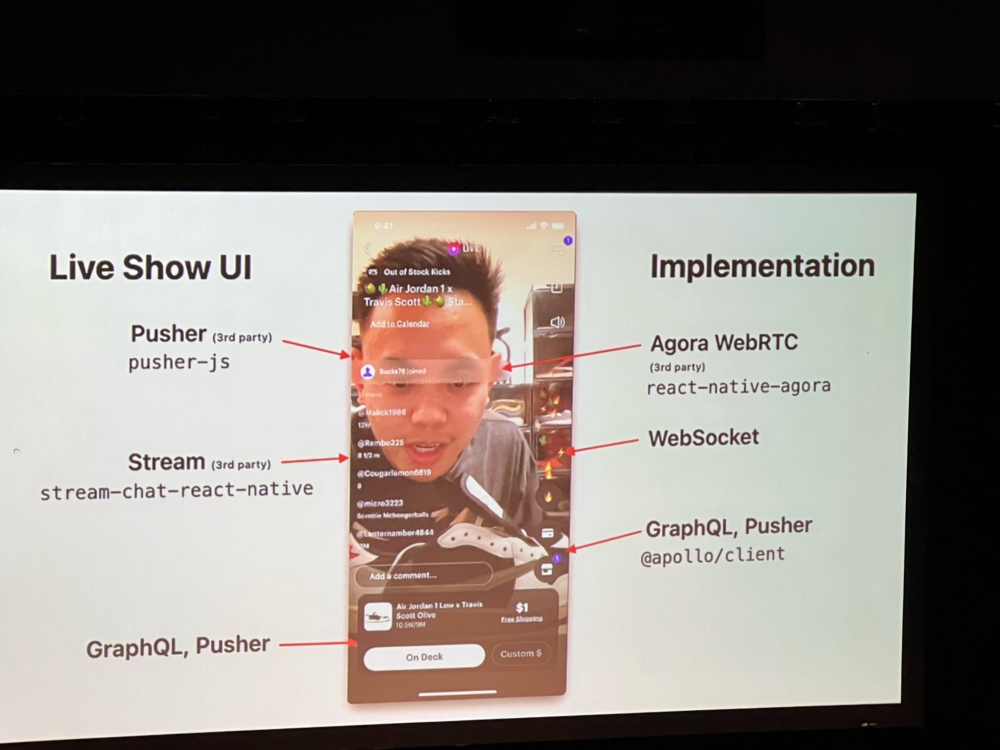
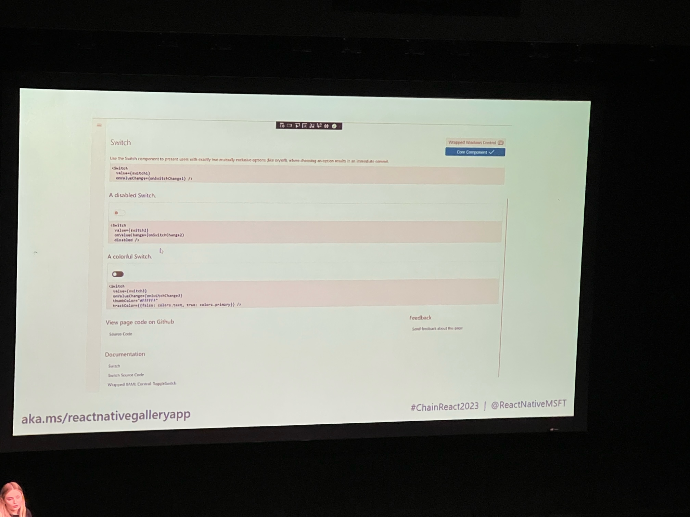

# Chain React Day 1

## Building a 5-star apps
- Users have decision fatigue
- More Android users than iOS users
    - Android users have a worse experience and are more critical

- How is rating calculated
    - iOS;  Overall average for all reviews
    - Android:  Weighted.. more weighting to reviews on current version

- Pre-empt common complaints
    - App Crashes
        - Add error boundardies
            - Introduced in React 16
                - static getDerivedStateFromError
                - componentDidCatch()
                - https://github.com/bvaughn/react-error-boundary

        - Communicate errors to user if you can
        - Error logging (Sentry)
        - Monitor releases
                    
    - Payments
        - Unit test 100%
        - Regression test before every releases

    
**App reviews are not just a reflection of your app, but the whole user experience**

- Types of negative reviews
    - In control
        - Bug reports
        - App Crashes
        - Misleading ux

    - Out of control
        - Service downtime
        - Delivery driver
        - Complaints on product selection

- Ask for positive reviews
    - Ask when a user is a good mood
    - Just completed a challenge
    - Just replied or liked a post
            
    - Use a custom prompt to check if a user is in a 5 star mood
        - If negative response show long form request for feedback
        - If positive, ask for app review 

## Take your react native app to the next level
- Outrage driven development
    - Key Principals
        - Have an excellence/owner mindset
        - Embrace positive change
        - Inclusitivty and engagement
        - Continuing education

    - Recognizing outragous code
        - "Thats weird"
        - "I wonder why that happened"
        - "That doesn't seem right"
        
    - Use weird screen sizes to find layout issues
    - Turn up/down system font sizes
    - Change accessibilty settings
    - Change to font to cool jazz
        - Change system fonts
    - Switch between light and dark mode
    
    - Don't overreact
    - Focus on finding solution
    - Always be moving forward
    - Constructive feedback
    - Use technology to enforce the rules
        - ESLint
        
    - Asking good questions
        - Identify the issue clearly
        - Create a story others can relate to
        - State what you know about the problem
            - Link to relevant code
        - Tag people who might be able to help
        - Assume the best intentions
        - Use visual aids
        - Only single message with a call to action
            - Not shotgun message

    - Practice using empathy
    - User security, privacy and accessibility as core design principals

## Shipping React Native apps
- Link:  https://ionic.link/3pR5SBs
    - Configure
        - Prepare app for distrobution
            - App Assets
            - Versions and IDs
            - Optimization and Security

    - Build
    - Upload
    - Test
    - Release

    - Benefits of automation
        - Reduce knowledge silos
        - Shared credntial and enviornments
        - Improved release velocity
        - Visibility

   -  Trapeze (https://trapeze.dev/)
        - Define YAML file
        D- ynamically update bundle ID

## Server Driven UI
- Layout API
    - Layout
        - Describes what componet to show
    - Component
        - Maps to a particular component in app
    - Action
        - Predefined set of action within the component
    - Content

## Livestream shopping app in React Native
NTWRK

    

## Accessibility
- Incorporating screen readers into RN
- Create 1 expereience for everyone
- Screen Readers
    - Test screen readers
        - accessibilityLabel

## Gateway to React
- React Docs
    - https://reactnative.dev/
    - https://react.dev/

## From Codegen to you first PR in core
 - Test Release Candidate
     - Discussions
     - Umbralla issues
         - Improving codegen
    
     - Claim a task
     - Fork the repo
     - Clone the repo
     - Write your code
     - Testing locally - Jest
     - Opening a PR

## Not your grandparents Expo
- https://docs.google.com/presentation/d/1IlbfqnW3t8lfNY5JKfd_2t6Ui-OFYUIvoMRbol62KJs/edit#slide=id.p

## Building for Microsoft

