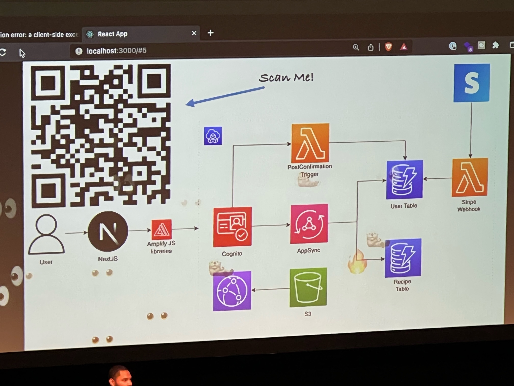

# Day 2

## The work you don't see
Talk about Microsoft's continued investments in React Native ecosystem

## Performance myths of React Native
- Link:  https://kulkarniankita.com/conferences/chainreact-23
     - Criteria for measuring performance
         - Measure specific behaviour
         - Keep same test cases
         - Test in prod mode
    
     - 3 important criteria 
         - CPU and Mempry
         - Application size
         - App startup time/FPS
             - Needs to run at 60 FPS
    
     - Rerenders cause performance issues
     - Remove console logs
         - remove-console-log babel
     - Avoid using scroll view
         - Load only items you need
         - Use FlatList or SectionList
         - As you scroll, items will re-render
             - Memoization
                 - Wrap the component in memo(Component)
             - Calculation of props is more costly than the entire component re-render

     - Complex component
         - use:
             - console.time()
             - Perf monitor

     - Animations
         - must be at least 60 fps
         - Use reanimated or lottie

         - Think twice before picking a library
         - Turn off animations in low data or low memory

     - Tools
         - Flipper
         - Reactatron
         - Xcode
         - React Profiler

     - Interaction Manager to scheduole tasks

     - Know when to go native vs React Native

     - Performance tips
         - Test on every device and network
         - Test on low end devices

## PUMA's mobile success stories
- Link:  https://robwalker.co/talks/
    - Puma app
    - Phased release
    - taged rollout

## Wait your shipping React Native to the web
- Guild: https://guild.host/taz
    - Tamagui - Design system
    - React Native URL Router
    - Server Side Rendering for React Native
     - Build custom on cloudflare workers
     - Remix
     - NextJS
    - Stitch React Native into native mobile

## I literaly just showed you
Talk about AWS Amplify
https://aws.amazon.com/amplify/studio/

## Super apps
- Integrates several services into one app
    - WeChat
    - AliPay
    - Gojek
    - Uber

- How to ship fast again
- How to ship fast again
    - Organize and decentralize
        - Solved on server with microservices
        - Solved on the web with microfrontends

        - Solved on native with micro-frontends
            - Dynmaic code delivery
                - Android
                    - Feature delivery
                    - WebView
                    - Hybrid JS framework
                - iOS 
                    - WebView
                    - Hybrid JS framework
                
                - Async bundle loading
                    - Metro
                    - Webpack
                    - Haul    
                        - Alternate CLI for webpack
                    - Module Federation
                        - Seperate module builds - same apps
                    
                    - Re.Pack (https://www.callstack.com/open-source/re-pack)
                        - Federated super apps
                        - Can use seperate or monorepos
                        - https://github.com/callstack/super-app-showcase

                        - Gotchas
                            - For big teams
                            - Need infrastructure team
                            - Release management
                            - no lazy loading native code
                            - Potential app store issues

## Default to performance
- React Native Performance
- https://shopify.github.io/react-native-performance/
    - Trust production data
    - test on mediorcre Android hardware
    - measure and compare end 2 end test
    - use console.time() or date.now()

    - State Management
        - Only update components as needed 
        - Easily unit testable
        - isolate state per-feature
            - Shared state
                - seperate state per feature
                - Global state - life of app
                - share state 
                - locakl state
                - lives in module (lifecycle managed via hooks)      

    - Rules of hooks
        - All hooks return stable values

        